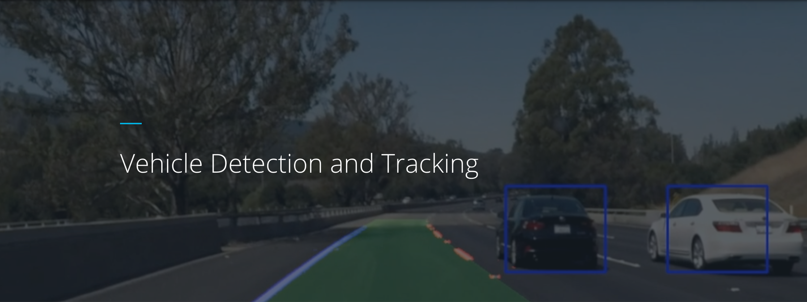

# Udacity Vehicle Detection Project

The purpose of this project is to create algorithms that can detect cars on a videostream. For each image we will apply following steps:

1. Feature extraction
2. Classification
3. Heatmap
4. Thresholding

## 1. Feature extraction

#### a) HOG feature detection

HOG stands for Histogram of oriented gradients and is a commonly used feature descriptor mostly used for object detection. The main advantage of this descriptor is the robustness against noise.

I used the function `skimage.hog()` in my code to calculate the HOG features.
An example visualization of HOG looks as follows:


#### b) Spatial binning

Another feature to describe the image is to use spatial binning. In this step the area of the image can be reduced in size and serialized. A smaller size of the image can still describe the image well enough to recognize objects. Example implementation:

```python
def bin_spatial(img, size=(32, 32)):
    color1 = cv2.resize(img[:,:,0], size).ravel()
    color2 = cv2.resize(img[:,:,1], size).ravel()
    color3 = cv2.resize(img[:,:,2], size).ravel()
    return np.hstack((color1, color2, color3))
```

#### c) Color histogram

The color histogram feature is a serialized histogram array of the image channels. Although this descriptor loses any shape information it is still a very good descriptor because of its robustness to any orientation changes of the image. Example implementation:

```python
def color_hist(img, nbins=32):
    # Compute the histogram of the color channels separately
    channel1_hist = np.histogram(img[:,:,0], bins=nbins)
    channel2_hist = np.histogram(img[:,:,1], bins=nbins)
    channel3_hist = np.histogram(img[:,:,2], bins=nbins)
    # Concatenate the histograms into a single feature vector
    hist_features = np.concatenate((channel1_hist[0], channel2_hist[0], channel3_hist[0]))
    # Return the individual histograms, bin_centers and feature vector
    return hist_features
```
#### d) Combining the features

The extracted features can be combined to have a single feature vector describing the image. This step however should be done carefully since the magnitudes of the individual features can be in different ranges that could lead to one feature to dominate the other ones by having a different weight. To overcome this the features should be normalized. I used `StandardScaler()` from Python's sklearn package.

## 2. Classification

In this step the image from the videostream has its features extracted and can be fed to the model that we have previously trained. The model will then classify if the image contains a car or not.

Lets take a look into the training samples:


As you can see the training data consists of vehicle images cropped out of full images, as well as random non car image patches.

To get a good classification result the expected "car" images fed to the classifier should be images that are at similar scale as the images in the training set. Since the input image of the videostream has only smaller regions that can contain a car, we will use a technique called "sliding window" to scan the input image for a car. We will divide the input image in smaller overlapping grid shaped areas and feed a single patch at a time to the classifier to maximize the chance that a possible car is at the same scale as the car training data.

With the output of the sliding window classification we can build a heat map since the region where the car is should result in multiple detection (overlapping windows and small step size).

An example classification after runnig the classifier with a sliding window:


This can be converted into a heatmap:


At this stage we can use a thresholding to eliminate random detection of cars (We expect multiple detection on the same region, ares with "low heat" can be filtered out). After thresholding we can draw a bounding box of connected "hot" regions:


#### Training
I used a linear support vector machine as my classifier. The training data was spit into to groups with 80/20 distribution as training and testing data sets. I used two classes for the label (car, noncar).

I tried different color spaces, and different paramenters for HOG to tweak my detection pipeline. I used spatial, hog and color histograms as features combined and normalized. 
I used multiple window sizes (scales) per image that increased the accuracy at a cost of performance (multiple sliding window searches).

Example of multiple window sizes (90x90, 96x96, 102x102 pixels) compared to the result above that has only one window size (96x96):


To further reduce false positives, I restricted the region of search only to the bottom half of the image where cars can appear.

Following parameters were used as final selection:

```python
#HOG parameters
orient = 9             # Number of orientations
pix_per_cell = 8       # Pixels per cell (8x8 pixels)
cell_per_block = 2     # Cells per block
colorspace = cv2.COLOR_BGR2YCrCb
hog_channel = 'ALL' # Can be 0, 1, 2, or "ALL"
spatial_size = (32, 32) # Spatial binning dimensions
hist_bins = 16    # Number of histogram bins

```


### Final video

Here is the link for the [final video](../code/project_combined_result.mp4).